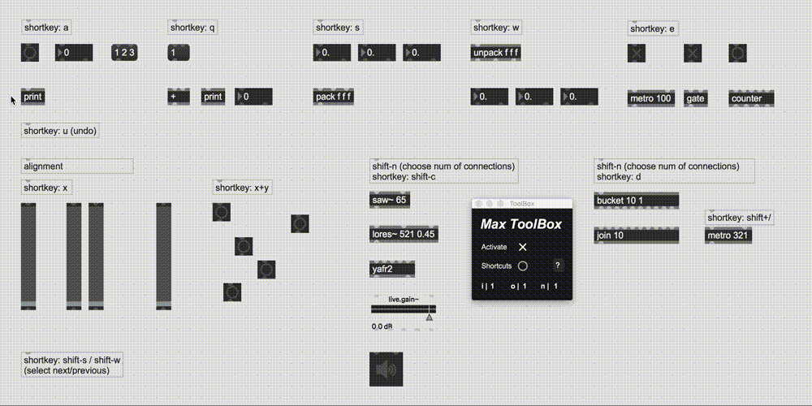

# Max ToolBox : Patch faster in Max/MSP

The Max ToolBox is a tool that simplifies aspects of patching within the Max/MSP environment. The main feature is the ability to quickly connect objects using keyboard shortcuts. You can:



## Features Overview

| function | shortkey |
| - | - |
| connect multiple objects to a single | `a` |
| connect single to multiple | `q` |
| connect multiple objects to consecutive inlets of one object | `s` |
| connect consecutive outlets of one object to a row | `w` |
| connect rows of objects in parallel | `e` |
| connect cascade | `C` (`shift` - `c`) |
| connect multiple inlets of one object to multiple inlets of another | `d` |
| choose number of inlet for next connection | `I` (`shift` - `i`) |
| choose number of outlet for next connection | `O` (`shift` - `o`) |
| choose number of connections to make from one object | `N` (`shift` - `n`) |
| create new object(s) with connection to selected object(s) | `\|` (`shift` - `\`) |
| select next object down | `S` (`shift` - `s`) |
| select next object up | `W` (`shift` - `w`) |
| distribute objects horizontally with even spacing | hold `x` |
| distribute objects vertically with even spacing | hold `y` |
| distribute objects diagonally with even spacing | hold `x` & `y` |
| custom connections via shell-style interface | `±` (`shift` - `§`) |
| send messages to objects via the shell | `±` (`shift` - `§`) |
| set ascending scriptingnames for objects | `@name myParam$` |
| customize shortkeys | |

## Documentation

[Open documentation](/docs/docs.md)

## Install (Max 8)

Download the latest version of the package for [Max 8](https://github.com/tmhglnd/maxtoolbox/archive/refs/heads/master.zip)

```
1. download latest code zip
2. unzip and place in Max Packages (on MacOS ~/Documents/Max 8/Packages)
3. restart Max8, open ToolBox from Menubar/Extras
4. click Activate
```

```
1. open terminal
2. $ cd ~/Documents/Max\ 8/Packages
3. $ git clone https://github.com/natcl/maxtoolbox.git
4. restart Max8, open ToolBox from Menubar/Extras
4. click Activate
```

### To re-install/update the ToolBox

1. Make sure you delete all files related to the ToolBox
2. Install as described above.

### For Max 7 and older

⚠️ **This version is temporarily not supported for Max 7 or older** ⚠️

- [**Please download this older commit**](https://github.com/tmhglnd/maxtoolbox/tree/8852b5a87e939a72f0dd8647bfffe05ed96106ba)

<!-- - [Max 5 and 6](https://github.com/natcl/maxtoolbox/archive/Version15.zip)
- [Max 4](https://maxtoolbox.googlecode.com/files/maxtoolbox_b8_max4.zip)

1. Place the ToolBox folder in one of your search path (Easiest is in "Cycling' 74")
2. Place the ToolBox.maxpat file in your extras folder -->

<!-- ## Contact me -->

<!-- You can contact me on [Twitter](https://twitter.com/natcl) or by email: maxtoolbox [at] studioimaginaire.com -->
