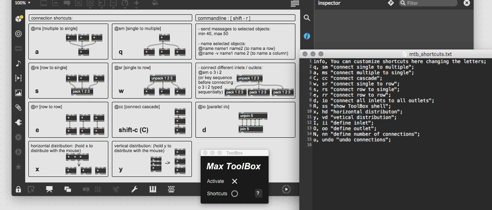

# Max ToolBox : Patch faster in Max/MSP

The Max ToolBox is a tool that simplifies aspects of patching within the Max/MSP environment. The main feature is the ability to quickly connect objects using keyboard shortcuts. You can:

- connect multiple to a single
- connect single to multiple
- connect a row to consecutive inlets of one object
- connect consecutive outlets of one object to a row
- connect cascade
- connect rows of objects in parallel
- distribute objects horizontally with even spacing
- distribute objects vertically with even spacing
- customize shortkeys
- custom connections via shell-style interface



## Downloads

[Max 7/8](https://github.com/tmhglnd/maxtoolbox/archive/refs/heads/master.zip)  

## Install (Max 7+)

```
1. download latest code zip
2. unzip and place in Max Packages (on MacOS ~/Documents/Max 8/Packages)
3. restart Max8, open ToolBox from Menubar/Extras
4. click Activate
```

```
1. open terminal
2. $ cd ~/Documents/Max\ 8/Packages
3. $ git clone https://github.com/natcl/maxtoolbox.git
4. restart Max8, open ToolBox from Menubar/Extras
4. click Activate
```

### To re-install/update the ToolBox

1. Make sure you delete all files related to the ToolBox
2. Install as described above.

### For Max 6 and older

- [Max 5 and 6](https://github.com/natcl/maxtoolbox/archive/Version15.zip)
- [Max 4](https://maxtoolbox.googlecode.com/files/maxtoolbox_b8_max4.zip)

1. Place the ToolBox folder in one of your search path (Easiest is in "Cycling' 74")
2. Place the ToolBox.maxpat file in your extras folder

## Contact me

You can contact me on [Twitter](https://twitter.com/natcl) or by email: maxtoolbox [at] studioimaginaire.com

## Donations

Donations are always appreciated.  [Thanks !](http://www.studioimaginaire.com/surfaceone/donate.html)

<a href='http://www.studioimaginaire.com/surfaceone/donate.html'></a>
